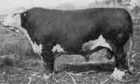

# Difference Between Bull and Ox

# Bull和Ox这两种公牛的区别

 

**Bull vs Ox**

The difference between a bull and a ox goes further than just how we refer to livestock.  Ox, or oxen, are actually used for different purposes than bulls.  An ox is typically used for things like pulling.  In developing countries they are still, to this day, used for pulling a plow and harvesting crops.

一头公牛和一个牛的区别远远不只是我们如何把牲畜。牛,牛比公牛实际上是用于不同的目的.牛通常用于拉之类的东西。他们仍然在发展中国家,这一天,用于拉犁和收割庄稼。

The bull is how we refer to cattle (or cows) when we speak of the male gender of the species.  The ox is scientifically coded as a sub-genus of the cattle.  Technically, this makes each a related species like cousins, but does not make them an identical species.

how is The牛公约we to奶牛(或)当我们说话的cows》《性别男》。scientifically is The牛coded作为sub-genus of The奶牛.从技术上讲,这使得每一个相关的物种像堂兄弟,但并不使它们相同的物种。

With the exception of a few that are used for breeding, it is customary to castrate the ox.  Bulls, however, are almost never castrated.  The bulls found within livestock are used for breeding purposes, as well as for stock purposes.  This creates the [need](http://www.differencebetween.net/language/difference-between-a-want-and-a-need/) to produce more cattle at a faster rate.  Oxen are more controlled when it comes to breeding.  This is generally because they are simply not considered much of a popular food source, especially in developed countries.

除了几个用于育种,习惯上阉割牛,牛,但是,几乎从来没有被阉割.公牛在牲畜用于繁殖的目的,以及股票的目的。这将创建(需要)(http://www.differencebetween).net/language/difference-between-a-want-and-a-need/)以更快的速度生产更多的牛。牛更育种时控制.这通常是因为他们不被认为是一个受欢迎的食物来源,尤其是在发达国家。

The ox is typically larger than a bull.  Oxen used as ‘draft’, or pulling animals, are usually beyond the age of four, to ensure that they are at their bulkiest and fullest, when it comes to their size.  Alternatively, most bulls are smaller than the ox, and beef cattle are generally slaughtered before they reach the age of four.

牛通常比一头牛.牛用作“草案”,或把动物,通常超出了四岁,以确保他们在笨重和充分,当涉及到他们的大小.另外,大多数牛比牛小,和牛肉通常屠杀才四岁。

Many mistakenly consider any castrated bull to be an ox.  However, this is inaccurate, as they share all of the bovine genes, but do have an actual distinctive genetic code that separates them from each other.

许多人错误地认为任何被阉割的公牛是一头牛.然而,这是不准确的,因为他们分享所有的牛的基因,但实际有一个独特的基因代码,将他们与彼此区分开来。

When it comes to symbolism, there are those cultures that consider them to be separate entities, and there are those that classify both bulls and oxen together.  The Chinese calendar offers representation to both the bull and the ox, for the years of birth including, but not limited to, 2009, 1997, and 1985.  Other cultures and religious affiliations often segregate the two animals.  Hindu celebrants recognize the ox.

象征意义时,有那些认为他们的文化是独立的实体,还有那些牛和牛在一起进行分类.中国日历提供了表示牛和牛,出生年包括,但不限于,2009,1997,1997.其他文化和宗教信仰往往隔离这两只动物。印度参加庆典的人们认识到牛。

Summary:

简介:

1.    The oxen are draft or pulling animals, usually used for cart transportation, or to pull plows.

1. 牛草案或动物,通常用于车运输,或拉犁。

2.    While both are part of the bovine family, the oxen are a sub-genus of the male cattle, or bull.

2. 虽然都是牛家族的一部分,牛是sub-genus男性牛,牛。

3.    Oxen are castrated, and breeding is more controlled and selective.

3. 牛是被阉割,育种是更多的控制和选择。

4.    The typical ox is larger than the typical bull

4. 典型的牛比典型的牛大

5.    The ox and the bull have similar, yet unique, genetic DNA codes.

5. 牛和牛有相似,但独特的基因DNA编码。

6.    While they maintain religious and ethnic symbolism, they are often heralded separately.

6. 时保持宗教和种族的象征意义,它们通常被分开。

原文链接: [http://www.differencebetween.net/science/nature/difference-between-bull-and-ox/](http://www.differencebetween.net/science/nature/difference-between-bull-and-ox/)